<!-- hero: monochrome ASCII portrait (types in) beside the Neofetch info card
     widths are matched so both panels align cleanly in a terminal layout.
     portrait: python scripts/prep_photo.py <photo> && python scripts/make_ascii_svg.py
     info card: python scripts/make_info_card.py -->

<h3><code>sunil@github ~ $ whoami</code></h3>

<table>
<tr>
<td valign="top"></td>
<td valign="top"></td>
</tr>
</table>

 
 

<!-- animated contribution graph: real data, boxes cascade diagonally
     (regenerated daily by .github/workflows/update-profile-art.yml) -->

<h3><code>sunil@github ~ $ ./contributions.sh</code></h3>

 
 

<h3><code>sunil@github ~ $ ./links.sh</code></h3>

<b>Sunil Sachindar S A · AI Automation Developer @ Google DeepMind · AI Researcher &amp; Builder</b>

 

